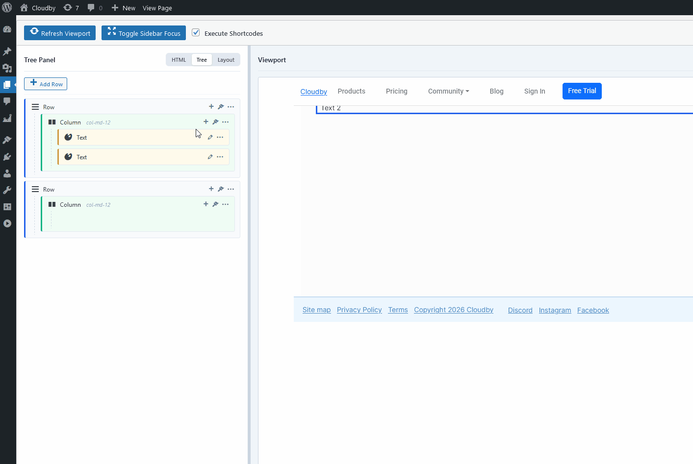

# **Docktree 🌳**

**Docktree** is a ultra-lightweight, DOM-first layout builder engine for WordPress. It completely bypasses complex, brittle JSON/serialized data configurations by treating **raw HTML as the single source of truth**.

Designed for developers who love clean layout control without the database bloat of conventional page builders.



## **⚡ Key Architectural Features**

* **DOM-First Ideology:** No parallel database models, state files, or serialization mismatch errors. If it's valid HTML, Docktree parses, tags, and manages it elegantly.
* **Non-Destructive UI Tagging Engine:** Scans standard Bootstrap structures (.row, .col-\*, .dt-widget) on the fly, dynamically applying safe, localized tracking IDs without altering core markup definitions.
* **SiteOrigin-Inspired Configuration Suite:** A spacious, independently scrollable two-column modal workflow that cleanly separates structural component configurations from granular class alignments and custom inline styles.
* **Isolated Viewport Sandbox:** Runs layout renders inside a completely isolated theme-wrapped iframe viewport. Refreshes updates seamlessly without breaking the parent editor view.
* **Asynchronous Save Operations:** Clicking "View Page" automatically commits the background layout code via admin AJAX handlers beforehand, guaranteeing your live views are always up-to-date.

## **🛠️ Tech Stack & Dependencies**

Docktree relies strictly on vanilla browser capabilities and rock-solid foundational scripts:

* **WordPress Engine:** Core Metadata Boxes, Settings, and Native Admin AJAX Hooks.
* **DOMParser API:** High-speed, native browser element serialization.
* **SortableJS:** Fluid, boundary-agnostic drag-and-drop hierarchy control across multi-nested visual levels.
* **jQuery UI & Inheritance Engine:** Extensible object-oriented widget architecture powering modular property dialog structures.

## **🚀 Quick Start Installation**

1. Download or clone this repository directly into your local WordPress installations directory:
```bash
   cd wp-content/plugins
   git clone https://github.com/kowkaybin/docktree.git
```
2. Navigate to your WordPress Admin dashboard ![][image1] **Plugins** and click **Activate**.
3. Create a standard **Page**—Gutenberg is disabled automatically, opening your clean, high-performance Docktree Canvas Workspace instantly.

## **📁 Core Codebase Landscape**
```
docktree/
├── docktree.php                 \# Core Bootstrapper, Script Registries & AJAX Routers
├── includes/
│   └── editor-ui.php            \# Three-Way Split Grid Admin Workspace Structure
├── templates/
│   └── preview-sandbox.php      \# Isolated Theme-Wrapped Viewport Canvas Environment
└── assets/
    ├── css/
    │   └── admin-style.css      \# Dual-Scroll Modals & Sortable Ghost Layout Skins
    └── js/
        ├── widgets.js           \# OOP jQuery UI Component Properties Subclasses
        └── editor.js            \# Workspace Interaction Hub & ID Collision Guards
```

## **🗺️ Project Roadmap: Whats Next**
We are officially leaving Phase 2's core interface structure behind and targeting modular widget expansion. Join us in building out the Components Marketplace within assets/js/widgets.js:

* Rich Text Expansion (widgetEditorText): Transitioning raw markup fields into live TinyMCE rich textual playgrounds.

* WP Media Library Core integration (widgetEditorImage): Hooking image selection directly into the default WordPress media modals instead of text input paths.

* Interactive Spacers (widgetEditorSpacer): Building real-time pixel slider metrics.

* Grid Component Wrappers (widgetEditorCard & widgetEditorButton): Standardizing structured markup outputs for Bootstrap component classes.